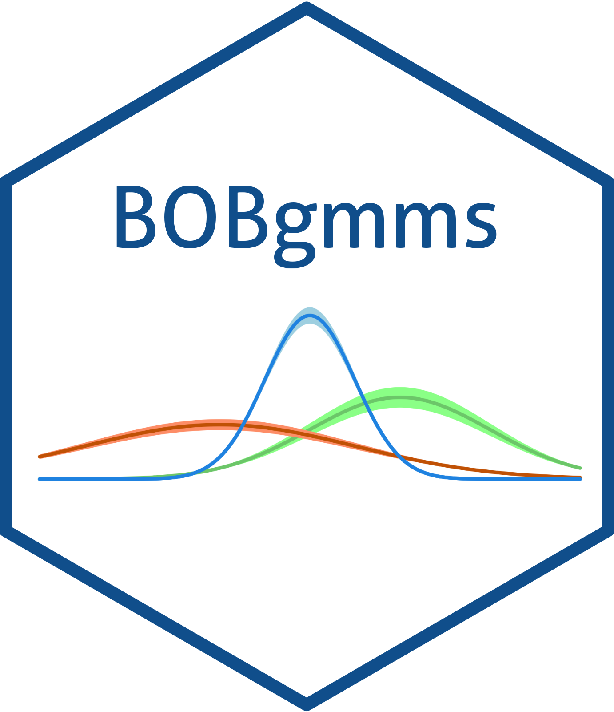

# BOBgmms  

<!-- badges: start -->


[](https://www.tidyverse.org/lifecycle/#experimental)

<!-- badges: end -->

</br>

## Overview

This repository contains the R package `BOBgmms` (developer's version), which implements the [Bayesian Optimized Bootstrap for Approximate Posterior Sampling in Gaussian Mixture Models](https://arxiv.org/abs/2311.03644) (Marin et al., 2025+).

## Installation

You can install the developer's version via `devtools` as:

``` r
# install.packages("devtools")
devtools::install_github("marinsantiago/BOBgmms")
```

On the other hand, if you wish to install the package from the `BOBgmms.zip` file in the supplementary materials to Marin et al. (2025+):

  1. Decompress the zip file `BOBgmms.zip`. The folder `BOBgmms` should result.
  
  2. In R, set your working directory to the folder `BOBgmms`.
  
  3. Run the following R code:
  
``` r
# install.packages("devtools")
devtools::build()
devtools::install()
```

## <a name="system"></a> System Requirements

Parallelization over mutiple CPU workers is conducted via *forking* (rather than *sockets*), so it only works on POSIX systems (i.e., macOS, Linux, Unix, BSD), not on Windows. To run the package functions on Windows, one would need to set the number of CPU workers to one. For further details, see [Package '`parallel`'](https://stat.ethz.ch/R-manual/R-devel/library/parallel/doc/parallel.pdf).

One can verify the OS type by running the following R code:

``` r
.Platform$OS.type
```

## Examples

Detailed guidelines for using the package functions are referred to their help pages in R. Additional examples are available at [https://github.com/marinsantiago/BOBgmms-examples](https://github.com/marinsantiago/BOBgmms-examples).

## <a name="cite"></a> Citation

If you use any part of this code in your work, please consider citing our paper:

```
@misc{marin_bob,
  title         = {BOB: Bayesian Optimized Bootstrap for Approximate Posterior Sampling in Gaussian Mixture Models}, 
  author        = {Santiago Marin and Bronwyn Loong and Anton H. Westveld},
  year          = {2024},
  eprint        = {2311.03644},
  archivePrefix = {arXiv},
  primaryClass  = {stat.ME}
}
```

## <a name="refs"></a> References

Marin, S., Loong, B., and Westveld, A. H. (2025+), "BOB: Bayesian Optimized Bootstrap for Uncertainty Quantification in Gaussian Mixture Models."
